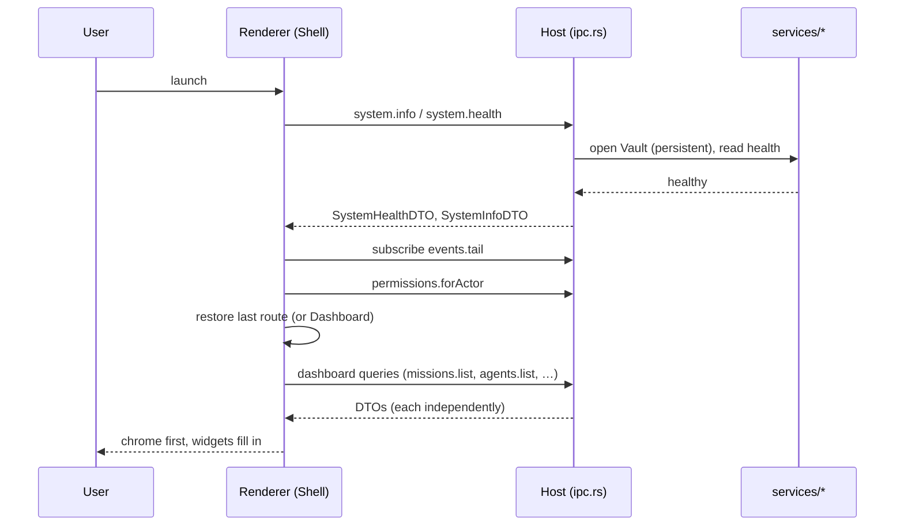
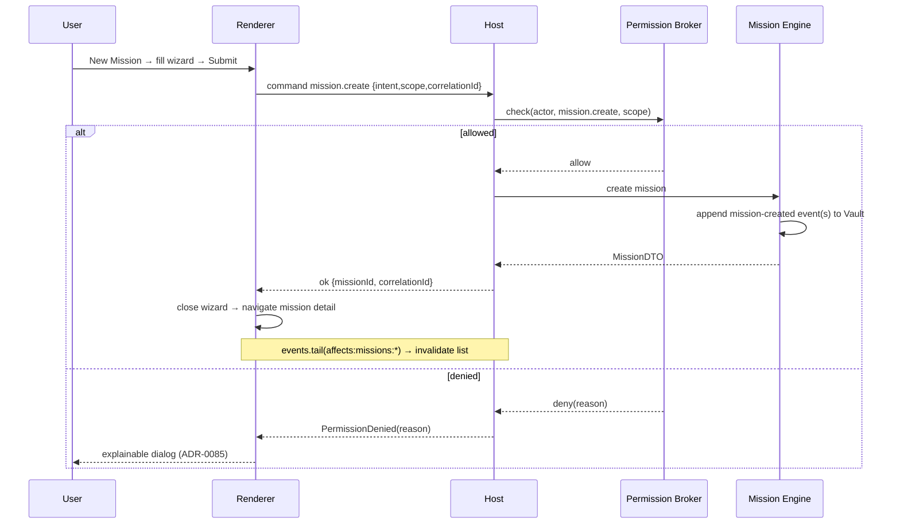
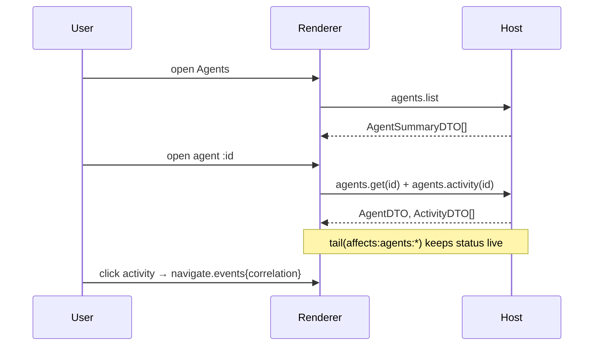
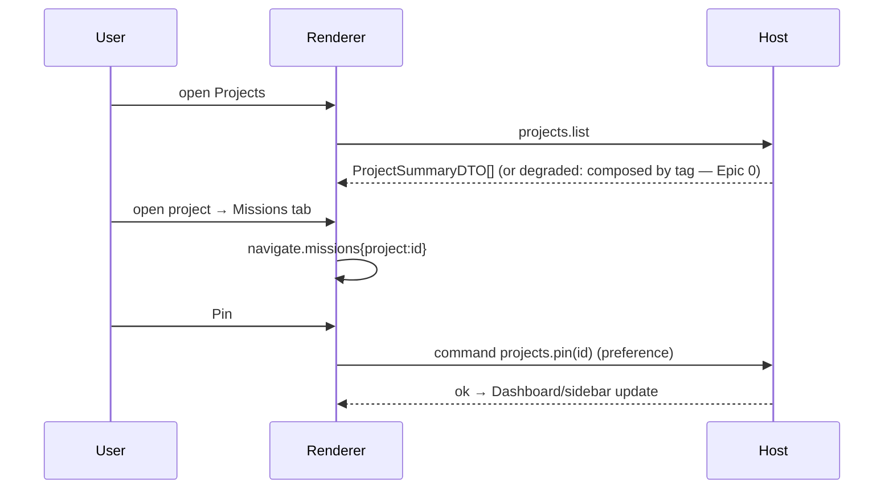
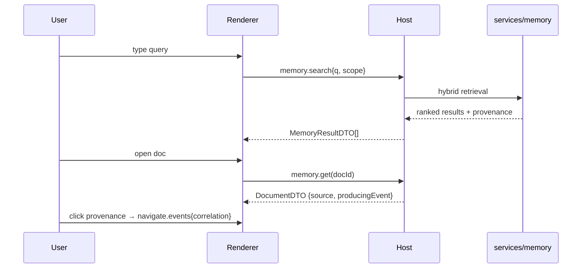
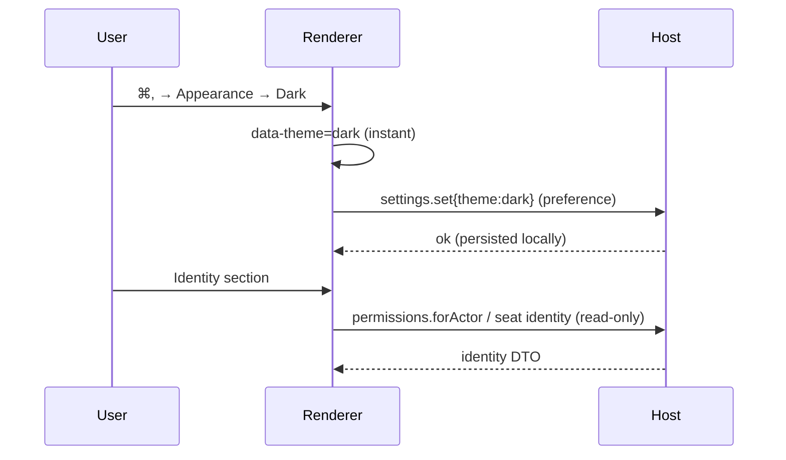
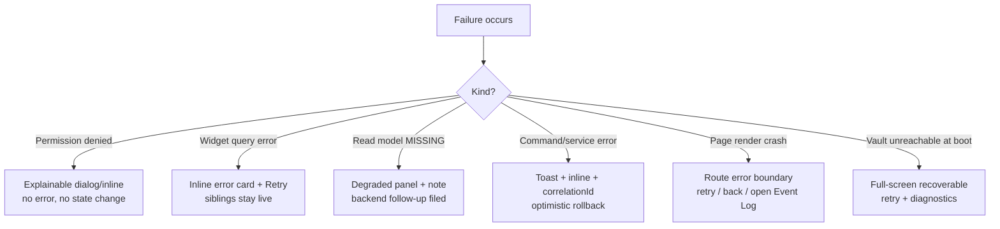

# UX Flow Documentation

Nine end-to-end flows. Each: **trigger → steps → data/commands → states →
success & failure.** Every write is a broker-gated command; every read is a
query; nothing bypasses the log. Diagrams are Mermaid sequence sketches
(renderer ↔ host ↔ services).

---

## 1. Opening Sidra

**Trigger.** User launches the desktop app.

Steps: splash/shell mounts → host opens the **persistent Vault** → providers
initialize (theme, query, permissions, tail) → route restored (last route or
Dashboard) → Dashboard widgets resolve independently.



States: chrome renders immediately; each widget shows skeleton→ready/empty/error.
**Success:** interactive Dashboard within the perf budget. **Failure:** Vault
unreachable → full-screen recoverable error with retry/diagnostics (`§8`), never
a blank window.

---

## 2. Creating a Mission

**Trigger.** "New Mission" (quick action / palette / `n`).

Steps: open wizard (`#/missions/new`) → Intent → Scope → Plan preview (engine
dry-run if available) → Review → submit `mission.create` → broker check → engine
appends event → route to `#/missions/:id`; list updates via tail.



States: submit shows loading; optimistic list insert (opt-in) reconciled by tail.
**Success:** mission visible + detail open within one tail cycle. **Failure:**
denial → dialog; engine error → toast + correlationId, no partial state.

---

## 3. Viewing Agents

**Trigger.** Sidebar → Agents (`g a`) or an `AgentCard`/mission link.

Steps: `agents.list` (grouped by department) → open `#/agents/:id` → `agents.get`
+ `agents.activity`; status is the orchestrator's live status via the tail;
activity items deep-link to events/missions. **Read-only** (no spawn in Sprint 1).



**Success:** accurate live status, activity deep-links resolve. **Failure:** a
failed query → widget error + retry; agent offline is a normal state, not an
error.

---

## 4. Opening Projects

**Trigger.** Sidebar → Projects (`g p`), a pinned project, or a project deep link.

Steps: `projects.list` → open `#/projects/:id` → tabs (overview/missions/
documents/activity); missions cross-link to Mission Center filtered to the
project; pin/unpin persists to preferences and reflects on Dashboard + sidebar.



**Success:** project detail with real counts; pin reflects immediately.
**Failure/degraded:** if the projects aggregate is MISSING, Projects composes
missions+documents by tag and shows a degraded note (`03 §6`).

---

## 5. Viewing Memory (Knowledge)

**Trigger.** Sidebar → Knowledge (`g k`), Dashboard Memory Overview, or a
document deep link.

Steps: enter a query → `memory.search` (engine hybrid retrieval) → results with
**provenance** → open `#/knowledge/:docId` → `memory.get` with source + producing
event; the UI renders the engine's ranking (never re-ranks as the answer).



**Success:** ranked results with provenance, respecting visibility. **Failure:**
retrieval limited in build → degraded state + still-usable browse; no client-side
fabricated ranking.

---

## 6. Searching (global) & commands

**Trigger.** ⌘/ (search) or ⌘K (commands).

Steps: overlay opens → type → `search.global` (federated, permission-scoped)
grouped results, or command registry matches → ↵ opens/deep-links, or dispatches
an action command (permission-aware).

```mermaid
sequenceDiagram
  participant U as User
  participant R as Renderer
  participant H as Host
  U->>R: ⌘/ then type
  R->>H: search.global{q}
  H-->>R: grouped results (visibility-scoped)
  U->>R: ↵ on a result
  R->>R: navigate.deepLink(result)
  Note over R: ⌘K path uses local command registry; actions dispatch commands
```

**Success:** relevant, scoped results; keyboard-complete; palette actions respect
permissions. **Failure:** search error → inline error in overlay + retry; empty →
"no matches" with a pivot to command palette.

---

## 7. Opening Settings

**Trigger.** ⌘, / sidebar footer.

Steps: `#/settings` → sections (appearance/shortcuts/notifications/identity/
diagnostics/about); appearance changes apply live and persist as preferences;
identity is read-only; `settings.set` writes preferences only (never
authoritative state).



**Success:** every appearance change is live + persisted; no setting mutates
platform truth. **Failure:** preference write failure → non-blocking notice;
change still applies for the session.

---

## 8. Handling Errors

**Trigger.** Any query/command failure, permission denial, degraded read model,
or fatal boot error.

Decision tree the shell applies (matches `02 §12`):



Rules: errors are **scope-isolated** (a widget never takes down chrome); denials
are **not** errors; every service error surfaces a copyable `correlationId` that
resolves in the Event Log; nothing is silently swallowed.

**Success:** the user always understands what failed, why, and the next step, and
the rest of the app stays usable.

---

## 9. Recovering Failures

**Trigger.** A recoverable condition: tail disconnect, transient service error, a
denied action that becomes allowable (after delegation/seat change), or a failed
mission.

Steps:

- **Tail disconnect →** status bar "reconnecting"; interval revalidation keeps
  data usable; on reconnect a full invalidation sweep restores live sync — **no
  data loss** because the log is intact.
- **Transient query/command error →** Retry (manual or automatic backoff for
  idempotent reads); correlationId available for support.
- **Denied → later allowed →** the denial dialog explains *what would make it
  allowable* (e.g. "needs Finance approver seat"); once a seat/delegation event
  arrives, the tail invalidates `permissions.forActor` and the affordance becomes
  enabled without a reload.
- **Failed mission →** the mission shows the failure and (if the engine permits)
  a `mission.retry` affordance; retry dispatches a broker-gated command; replay
  remains available to diagnose.

```mermaid
sequenceDiagram
  participant R as Renderer
  participant H as Host
  Note over R,H: tail drops
  R->>R: status: reconnecting; interval revalidate
  R->>H: reconnect events.tail
  H-->>R: tail live
  R->>R: invalidateQueries() full sweep → live again
```

**Success:** the app self-heals to a live, log-consistent state; the user is
never stranded and never loses data; every recovery path is visible and
actionable.
