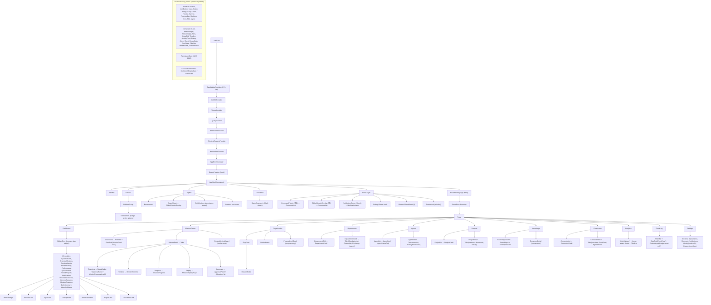

# Deliverable 4 — Component Tree

The runtime composition. Providers wrap once; `AppShell` is persistent; the
`RouteOutlet` swaps pages. Domain/composite/primitive components compose within
pages. (Names match `07-component-library.md` and `12-folder-structure.md`.)

**Reading the tree.**
- **Persistent vs swapped:** everything from `AppShell` down *except* `Outlet →
  Page` is persistent; only `Page` changes on navigation.
- **Error isolation:** `AppErrorBoundary` (outside router) → `RouteErrorBoundary`
  (per page) → `WidgetErrorBoundary` (per dashboard widget). A crash is contained
  at the tightest boundary.
- **Data flow:** pages (containers) call `data/` (IPC + Query) and pass DTOs +
  callbacks into `components/`; components never fetch (`07 §5`). The `Shared`
  block is imported by every page but imports nothing above the primitive layer.
- **Permission-aware nodes:** every mutating leaf (QuickActions, ApprovalPanel,
  GrantRow, NotificationItem action, wizard submit, propose actions) is wrapped by
  or consumes `PermissionGate`.
