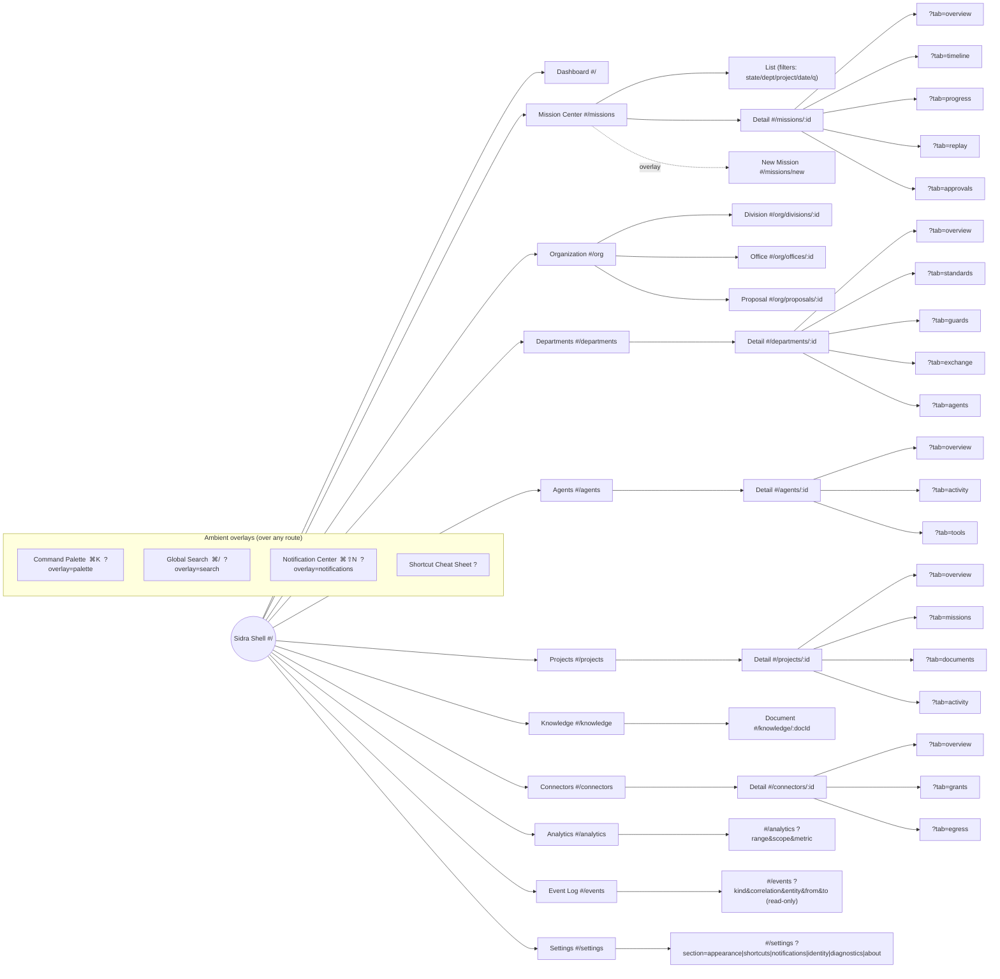

# Deliverable 5 — Navigation Tree

The navigable structure of the shell, derived 1:1 from the route table
(`09-routing.md §2`). Primary destinations are sidebar items; nested nodes are
detail routes and tabs; overlays are addressable surfaces layered over any route.

## Cross-links (non-hierarchical navigation)

Deep links wire the graph together beyond the tree:

| From | To |
|---|---|
| Dashboard widget | its owning page, filtered |
| Mission timeline entry / any correlationId | `#/events?correlation=…` |
| Agent "current mission" | `#/missions/:id` |
| Department "agents" / "connectors" | `#/agents?dept=…` / `#/connectors?…` |
| Connector grant "target" | `#/departments/:id` |
| Knowledge result "source"/"provenance" | connector/mission/event |
| Notification "open"/"act" | the underlying entity + command |
| Project "missions" | `#/missions?project=…` |
| Search result | any deep link above |

## Navigation rules (summary)

- **Primary** (sidebar) selects a top-level route; **contextual** (tabs,
  breadcrumb) moves within; **ambient** (palette/search/deep links) jumps anywhere.
- **Tabs** update `?tab=` via replace (Back doesn't step through tabs); leaving
  and returning restores the last tab.
- **Overlays** layer over the current route and dismiss Back/Esc-first before the
  page pops.
- **Filters** live in URL params so list state survives detail round-trips.
- Every node here corresponds to exactly one typed route in `routeTable.ts`; the
  tree and the table cannot diverge.
