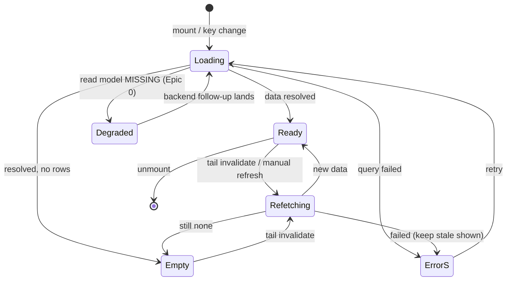
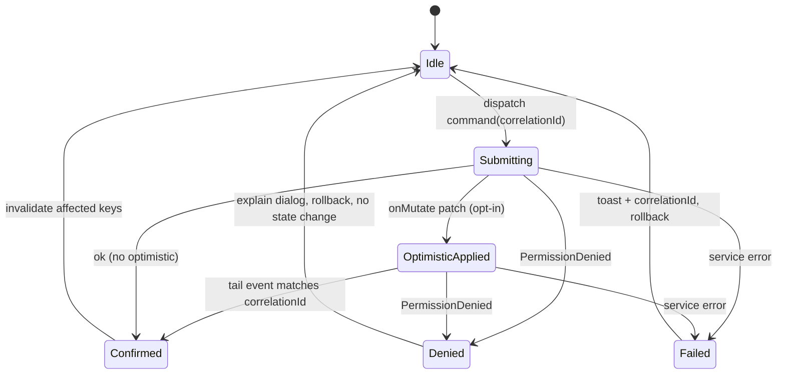
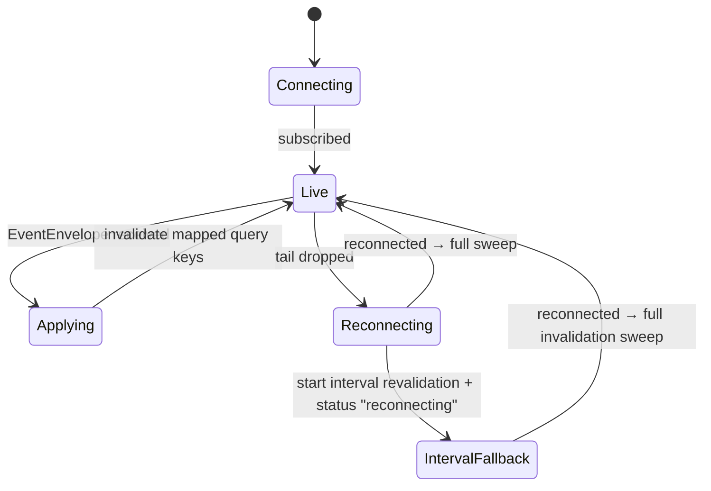
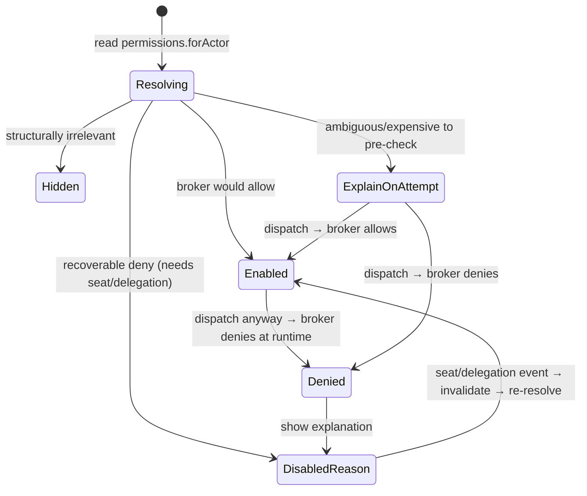
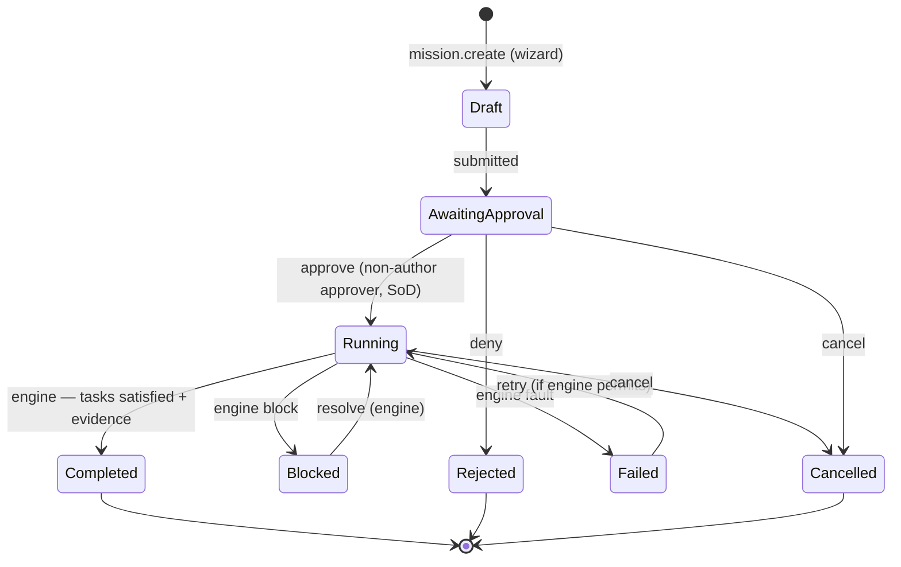

# Deliverable 6 — State Diagrams

The shell's runtime state machines. The **mission lifecycle machine is the
engine's** — the UI renders it, it does not own it (`05 §3`). The remaining
machines are UI-plane concerns (data fetching, command dispatch, tail
connection, permission affordance, shell surfaces).

---

## 1. Data surface (per query) — the five-state contract

Precedence when multiple apply: `error → degraded → loading(first) → empty →
ready` (`02 §12.4`). Background refetch keeps stale content visible (never
blanks).

---

## 2. Command / mutation lifecycle

Denial is **not** an error path — it rolls back and explains (ADR-0085).
Confirmation is authoritative only once the matching tail event arrives.

---

## 3. Event-tail connection (freshness engine)

Tail loss never loses data (the log is intact); it only degrades freshness to
polling until reconnect (`08 §4`, `10 §9`).

---

## 4. Permission affordance (per gated action)

Even `Enabled` re-checks server-side on dispatch — the UI state is a prediction,
never the enforcement (ADR-0085/0006).

---

## 5. Mission lifecycle (engine-owned; UI renders)

The UI offers a transition control **only** when the DTO reports the transition
valid **and** the broker would allow it. `approve` from `AwaitingApproval` is
shown-disabled for the author (SoD, ADR-0008/0018/0060). Blocked/Failed are
engine-driven; the UI reflects them.

---

## 6. Shell surface (overlay) machine

```mermaid
stateDiagram-v2
  [*] --> Page
  Page --> Palette: ⌘K
  Page --> Search: ⌘/
  Page --> Notifications: ⌘⇧N
  Page --> Dialog: action needs confirm
  Palette --> Page: Esc/Back/select
  Search --> Page: Esc/Back/select
  Notifications --> Page: Esc/Back
  Dialog --> Page: confirm/cancel
  note right of Dialog: Overlays form a stack;\nEsc/Back closes the TOP overlay\nbefore popping the page (02 §2)
```

---

## Diagram-to-spec map

| Diagram | Governed by |
|---|---|
| Data surface | `02 §12`, `08 §4` |
| Command lifecycle | `01 §4`, `08 §5`, ADR-0085 |
| Event tail | `01 §7`, `08 §9`, `10 §9` |
| Permission affordance | ADR-0085/0006 |
| Mission lifecycle | `05 §3`, engine (M15) |
| Overlay | `02 §2`, `09 §4` |
