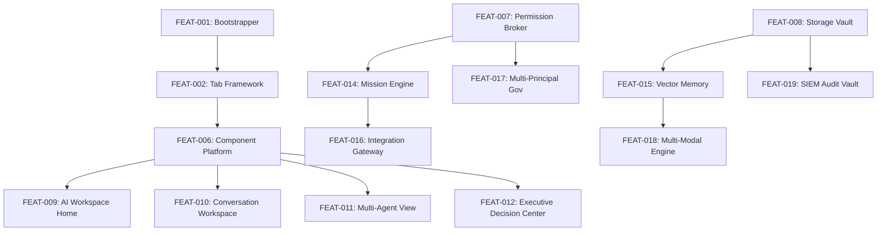

# Feature Dependency Graph

> **Governance Authority:** Program E05.5  
> **Status:** OFFICIAL & CERTIFIED  

---

## 1. Feature Dependency Diagram

The following Mermaid diagram maps the prerequisite relationships across core infrastructure, security, data storage, AI orchestration, and presentation components:

---

## 2. Dependency Rules

1. **Foundational Immunity**: Infrastructure features (`FEAT-001` through `FEAT-008`) MUST NOT depend on higher-level AI features (`FEAT-009` through `FEAT-020`).
2. **Domain Purity**: Domain model types MUST remain strictly decoupled from I/O connectors and UI rendering components.
